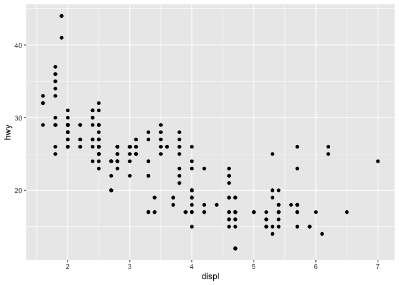

Class 5: Data Visualization with GGPLOT
================
Kyle

# Our first ggplot

To use the ggplot 2 package I first need to have it installed on my
computer.

To install any package we use the `install.packages()` command

Now can I use it? NO! First we need tl call `library(ggplot2)`

``` r
library(ggplot2)
ggplot()
```


``` r
mpg
```

    # A tibble: 234 × 11
       manufacturer model      displ  year   cyl trans drv     cty   hwy fl    class
       <chr>        <chr>      <dbl> <int> <int> <chr> <chr> <int> <int> <chr> <chr>
     1 audi         a4           1.8  1999     4 auto… f        18    29 p     comp…
     2 audi         a4           1.8  1999     4 manu… f        21    29 p     comp…
     3 audi         a4           2    2008     4 manu… f        20    31 p     comp…
     4 audi         a4           2    2008     4 auto… f        21    30 p     comp…
     5 audi         a4           2.8  1999     6 auto… f        16    26 p     comp…
     6 audi         a4           2.8  1999     6 manu… f        18    26 p     comp…
     7 audi         a4           3.1  2008     6 auto… f        18    27 p     comp…
     8 audi         a4 quattro   1.8  1999     4 manu… 4        18    26 p     comp…
     9 audi         a4 quattro   1.8  1999     4 auto… 4        16    25 p     comp…
    10 audi         a4 quattro   2    2008     4 manu… 4        20    28 p     comp…
    # … with 224 more rows

Our first plot of displ vs hwy All ggplot() graphs are made in the same
way.

- data + aes + geoms

``` r
ggplot(mpg) + 
  aes(x=displ, y=hwy) +
  geom_point()
```



I can add more layers: Look at the documentation using `?function_name`
in order to see what a certain function does and what arguments it
takes.

``` r
ggplot(mpg) + 
  aes(x=displ, y=hwy) +
  geom_point() +
  geom_smooth(method = lm, se = FALSE)
```

    `geom_smooth()` using formula = 'y ~ x'


In order to add labels and a theme for the graph use `labs()` and
`theme_bw()`

``` r
ggplot(cars) +
  aes(x=speed, y=dist) +
  geom_point() +
  geom_smooth(method="lm", se= FALSE) +
  theme_bw()
```

    `geom_smooth()` using formula = 'y ~ x'


# Plot of gene expression data

First read the data from online.

``` r
url <- "https://bioboot.github.io/bimm143_S20/class-material/up_down_expression.txt"
genes <- read.delim(url)
head(genes)
```

            Gene Condition1 Condition2      State
    1      A4GNT -3.6808610 -3.4401355 unchanging
    2       AAAS  4.5479580  4.3864126 unchanging
    3      AASDH  3.7190695  3.4787276 unchanging
    4       AATF  5.0784720  5.0151916 unchanging
    5       AATK  0.4711421  0.5598642 unchanging
    6 AB015752.4 -3.6808610 -3.5921390 unchanging

> Q. How many genes are in this dataset?

``` r
nrow(genes)
```

    [1] 5196

What are the colnames?

``` r
colnames(genes)
```

    [1] "Gene"       "Condition1" "Condition2" "State"     

How to make this into a ggplot?

``` r
ggplot(genes) +
  aes(x = Condition1, y= Condition2) +
  geom_point();
```


Let’s add some color. To tdo this we can add another `aes()` mapping of
color to the `State` column in our data

``` r
p <- ggplot(genes) +
  aes(x = Condition1, y= Condition2, col = State) +
  geom_point();
```

> Q. How many genes are up regulated and down regulated?

``` r
head(genes)
```

            Gene Condition1 Condition2      State
    1      A4GNT -3.6808610 -3.4401355 unchanging
    2       AAAS  4.5479580  4.3864126 unchanging
    3      AASDH  3.7190695  3.4787276 unchanging
    4       AATF  5.0784720  5.0151916 unchanging
    5       AATK  0.4711421  0.5598642 unchanging
    6 AB015752.4 -3.6808610 -3.5921390 unchanging

To get at just the State column `table()` helps summarize data

``` r
table(genes$State)
```


          down unchanging         up 
            72       4997        127 

To find the fraction of total genes up-regulated we can use `round()`

``` r
round( table(genes$State)/nrow(genes) * 100, 2)
```


          down unchanging         up 
          1.39      96.17       2.44 

In order to change color of the plot can use `scale_color_manual()`

``` r
p + scale_color_manual( values=c("blue", "gray", "red"))
```


Lets add some labels to our newly colored graph (Remember: Use `labs()`)

``` r
p + scale_color_manual( values=c("blue", "gray", "red")) +
  labs(title="Gene Expression Changes Upon Treatment", x="Control (no drug)", y="Drug Treatment")
```


