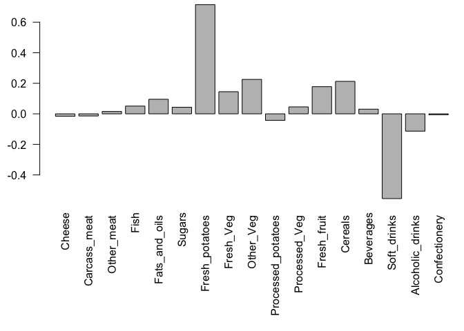
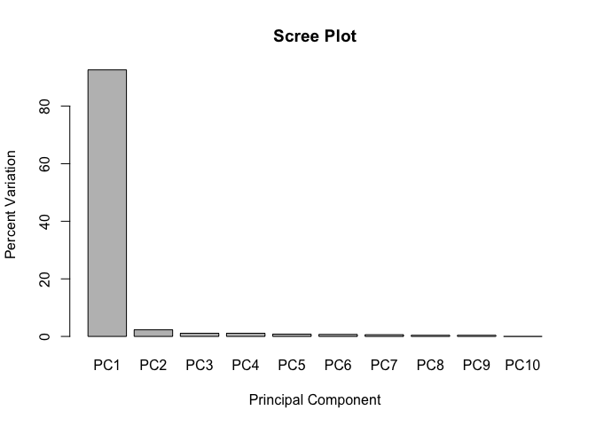

Class 7 Machine Learning 1
================
Kyle Alvarez

# K-means clustering

First we will test how this method works in R with some made up data.

``` r
x <- rnorm(10000)
hist(x)
```


Let’s make some numbers centered on -3

``` r
rev(c("a", "b", "c"))
```

    [1] "c" "b" "a"

``` r
tmp <-  c(rnorm(30, -3), rnorm(30, +3))

x <- cbind(x= tmp, y= rev(tmp))
plot(x)
```


Now, let’s see how `kmeans()` works with this data…

``` r
km <- kmeans(x, centers = 2, nstart=20)
km
```

    K-means clustering with 2 clusters of sizes 30, 30

    Cluster means:
              x         y
    1 -3.076724  2.999228
    2  2.999228 -3.076724

    Clustering vector:
     [1] 1 1 1 1 1 1 1 1 1 1 1 1 1 1 1 1 1 1 1 1 1 1 1 1 1 1 1 1 1 1 2 2 2 2 2 2 2 2
    [39] 2 2 2 2 2 2 2 2 2 2 2 2 2 2 2 2 2 2 2 2 2 2

    Within cluster sum of squares by cluster:
    [1] 66.85216 66.85216
     (between_SS / total_SS =  89.2 %)

    Available components:

    [1] "cluster"      "centers"      "totss"        "withinss"     "tot.withinss"
    [6] "betweenss"    "size"         "iter"         "ifault"      

``` r
km$centers
```

              x         y
    1 -3.076724  2.999228
    2  2.999228 -3.076724

> Q. How many points are in each cluster?

``` r
km$size # cluster size 
```

    [1] 30 30

> Q. What ‘component’ of your result object details - cluster size? -
> cluster assignment/membership? - cluster center?

``` r
km$cluster #cluster assignment/membership
```

     [1] 1 1 1 1 1 1 1 1 1 1 1 1 1 1 1 1 1 1 1 1 1 1 1 1 1 1 1 1 1 1 2 2 2 2 2 2 2 2
    [39] 2 2 2 2 2 2 2 2 2 2 2 2 2 2 2 2 2 2 2 2 2 2

``` r
km$centers #cluster centers
```

              x         y
    1 -3.076724  2.999228
    2  2.999228 -3.076724

> Q. Plot x colored by the kmeans cluster assignment and as cluster
> centers as blue points

``` r
plot(x, col = km$cluster)
points(km$centers, col = "blue", pch=15, cex = 2)
```


``` r
#pch changes the shape
#cex makes it bigger or smaller
```

# Hierarchical Clustering

The `hclust()` function in R performs hierarchical clustering

The `hclust()` function requires an input distance matrix, which I can
get from the `dist()` function.

``` r
hc <- hclust(dist(x))
hc
```


    Call:
    hclust(d = dist(x))

    Cluster method   : complete 
    Distance         : euclidean 
    Number of objects: 60 

There is a `plot()` method for hclust objects…

``` r
plot(hc)
```


Now to get my cluster membership vector I need to “cut” the tree to
yield separate “branches” with the “leaves” on each branch being our
cluster. To do this we use the `cutree()` function.

``` r
cutree(hc, h=8)
```

     [1] 1 1 1 1 1 1 1 1 1 1 1 1 1 1 1 1 1 1 1 1 1 1 1 1 1 1 1 1 1 1 2 2 2 2 2 2 2 2
    [39] 2 2 2 2 2 2 2 2 2 2 2 2 2 2 2 2 2 2 2 2 2 2

Use `cutree()` with a k=2.

``` r
grps <- cutree(hc, k=2)
```

A plot of our data colored by our hclust grps.

``` r
plot(x, col = grps)
```


# Principal Component Analysis (PCA)

First, import data of “UK_foods”

``` r
url <- "https://tinyurl.com/UK-foods"
foods <- read.csv(url, row.names = 1)
```

> Q1. How many rows and columns are in your new data frame named x? What
> R functions could you use to answer this questions?

Can use the `dim()` function which returns the number of rows and
columns of a data frame

``` r
dim(foods)
```

    [1] 17  4

Now we should check our data using the `view()` function

``` r
View(foods)
```

Clean up our data frame as we were only expecting 4 columns (one for
each country in the UK).

``` r
## Not good
##rownames(foods) <- foods[,1]
##foods <- foods[, -1]
##head(foods)
```

> Q2. Which approach to solving the ‘row-names problem’ mentioned above
> do you prefer and why? Is one approach more robust than another under
> certain circumstances?

The apporach in which we manually delete the column name isn’t as good
because everytime that chunk of code runs, it will delete each column as
it runs. So using the `row.names=1` argument in the `read.csv()`
function is preferable as it doesn’t do this.

Can use a bar plot to plot the data above

``` r
barplot(as.matrix(foods), beside=T,  col=rainbow(nrow(foods)))
```


> Q3: Changing what optional argument in the above barplot() function
> results in the following plot?

``` r
barplot(as.matrix(foods), beside=F,  col=rainbow(nrow(foods)))
```


The optional argument changes the barplot to stack the different foods
on top eachother for each country.

> Q5: Generating all pairwise plots may help somewhat. Can you make
> sense of the following code and resulting figure? What does it mean if
> a given point lies on the diagonal for a given plot?

``` r
pairs(foods, col=rainbow(10), pch=16)
```


If a point lies on the diagonal for a given plot, that means they are
positively correlated, which also means they are essentially the same
amount. The following code above, basically makes a pair plot for one
country vs another country, for all the countries.

While this is kind of useful, it takes work to dig into the details here
to find out what is different in these countries.

> Q6. What is the main differences between N. Ireland and the other
> countries of the UK in terms of this data-set?

The main different between N. Ireland and other countries of the UK in
terms of this data-set is that there is a blue dot that is higher in N.
Ireland compared to other countries.

## PCA to the Rescue

Principal Component Analysis (PCA for short) can be a big help in these
cases where we have lot’s of things that are being measured in a
dataset.

The main PCA function in base R is called `prcomp()`.

Note: The `prcomp()` function wants as input the transpose of our food
matrix/table/data.frame

``` r
pca <- prcomp( t(foods) )
summary(pca)
```

    Importance of components:
                                PC1      PC2      PC3       PC4
    Standard deviation     324.1502 212.7478 73.87622 4.189e-14
    Proportion of Variance   0.6744   0.2905  0.03503 0.000e+00
    Cumulative Proportion    0.6744   0.9650  1.00000 1.000e+00

The above result shows that PCA captures 67% of the total variance in
the original data in one PC and 96.5% in two PCs.

``` r
head(pca$x)
```

                     PC1         PC2         PC3           PC4
    England   -144.99315    2.532999 -105.768945  2.842865e-14
    Wales     -240.52915  224.646925   56.475555  7.804382e-13
    Scotland   -91.86934 -286.081786   44.415495 -9.614462e-13
    N.Ireland  477.39164   58.901862    4.877895  1.448078e-13

Let’s plot our main results.

> Q7. Complete the code below to generate a plot of PC1 vs PC2. The
> second line adds text labels over the data points.

``` r
# Plot PC1 vs PC2
plot(pca$x[,1], pca$x[,2], xlab="PC1", ylab="PC2", xlim=c(-270,500))
text(pca$x[,1], pca$x[,2], colnames(foods))
```


> Q8. Customize your plot so that the colors of the country names match
> the colors in our UK and Ireland map and table at start of this
> document.

``` r
#Color our plot
plot(pca$x[,1], pca$x[,2], xlab="PC1", ylab="PC2", xlim=c(-270,500), col=c("orange", "red", "blue", "green"))
text(pca$x[,1], pca$x[,2], colnames(foods), col=c("orange", "red", "blue", "green"))
```


Calculate how much standard deviation to calculate how much variation in
the original data each PC accounts for.

``` r
v <- round( pca$sdev^2/sum(pca$sdev^2) * 100 )
v
```

    [1] 67 29  4  0

``` r
## or the second row here...
z <- summary(pca)
z$importance
```

                                 PC1       PC2      PC3          PC4
    Standard deviation     324.15019 212.74780 73.87622 4.188568e-14
    Proportion of Variance   0.67444   0.29052  0.03503 0.000000e+00
    Cumulative Proportion    0.67444   0.96497  1.00000 1.000000e+00

We can summarize the plot of variances (eigenvalues) with respect to the
principal component number (eigenvector number)

``` r
barplot(v, xlab="Principal Component", ylab="Percent Variation")
```


We can consider the influence of each of the original variables upon the
principal components (loading scores). Can be summarized with a call to
`biplot()`

``` r
## Lets focus on PC1 as it accounts for > 90% of variance 
par(mar=c(10, 3, 0.35, 0))
barplot( pca$rotation[,1], las=2 )
```


> Q9: Generate a similar ‘loadings plot’ for PC2. What two food groups
> feature prominantely and what does PC2 maninly tell us about?

``` r
par(mar=c(10, 3, 0.35, 0))
barplot( pca$rotation[,2], las=2 )
```



The two food groups that are featured prominately are fresh potatoes and
soft drinks. PC2 mainly tells us the second most variation.

Can use a biplot to visualize PCA (main way):

``` r
## The inbuilt biplot() can be useful for small datasets 
biplot(pca)
```


## PCA of RNA-seq data

``` r
url2 <- "https://tinyurl.com/expression-CSV"
rna.data <- read.csv(url2, row.names=1)
head(rna.data)
```

           wt1 wt2  wt3  wt4 wt5 ko1 ko2 ko3 ko4 ko5
    gene1  439 458  408  429 420  90  88  86  90  93
    gene2  219 200  204  210 187 427 423 434 433 426
    gene3 1006 989 1030 1017 973 252 237 238 226 210
    gene4  783 792  829  856 760 849 856 835 885 894
    gene5  181 249  204  244 225 277 305 272 270 279
    gene6  460 502  491  491 493 612 594 577 618 638

> Q10: How many genes and samples are in this data set?

``` r
dim(rna.data)
```

    [1] 100  10

There is 100 genes and 10 samples.

Can generate our data using PCA

``` r
## Again we have to take the transpose of our data 
pca <- prcomp(t(rna.data), scale=TRUE)
 
## Simple un polished plot of pc1 and pc2
plot(pca$x[,1], pca$x[,2], xlab="PC1", ylab="PC2")
```


Summary of how much variation in the original data PC accounts for:

``` r
summary(pca)
```

    Importance of components:
                              PC1    PC2     PC3     PC4     PC5     PC6     PC7
    Standard deviation     9.6237 1.5198 1.05787 1.05203 0.88062 0.82545 0.80111
    Proportion of Variance 0.9262 0.0231 0.01119 0.01107 0.00775 0.00681 0.00642
    Cumulative Proportion  0.9262 0.9493 0.96045 0.97152 0.97928 0.98609 0.99251
                               PC8     PC9      PC10
    Standard deviation     0.62065 0.60342 3.348e-15
    Proportion of Variance 0.00385 0.00364 0.000e+00
    Cumulative Proportion  0.99636 1.00000 1.000e+00

Can use a barplot summary of the Proportion of Variance for each PC

``` r
plot(pca, main="Quick scree plot")
```


Can use the square of `pca$dev` (standard deviation), to calculate how
much variation in the original data each PC accounts for

``` r
## Variance captured per PC 
pca.var <- pca$sdev^2

## Percent variance is often more informative to look at 
pca.var.per <- round(pca.var/sum(pca.var)*100, 1)
pca.var.per
```

     [1] 92.6  2.3  1.1  1.1  0.8  0.7  0.6  0.4  0.4  0.0

Then using these calculations, we can generate a scree-plot:

``` r
barplot(pca.var.per, main="Scree Plot", 
        names.arg = paste0("PC", 1:10),
        xlab="Principal Component", ylab="Percent Variation")
```



Can color our PCA plot to make it more aesthetic:

``` r
## A vector of colors for wt and ko samples
colvec <- colnames(rna.data)
colvec[grep("wt", colvec)] <- "red"
colvec[grep("ko", colvec)] <- "blue"

plot(pca$x[,1], pca$x[,2], col=colvec, pch=16,
     xlab=paste0("PC1 (", pca.var.per[1], "%)"),
     ylab=paste0("PC2 (", pca.var.per[2], "%)"))

text(pca$x[,1], pca$x[,2], labels = colnames(rna.data), pos=c(rep(4,5), rep(2,5)))
```


## Using ggplot2

Can use ggplot to plot our PCA results:

``` r
library(ggplot2)

df <- as.data.frame(pca$x)

# Our first basic plot
ggplot(df) + 
  aes(PC1, PC2) + 
  geom_point()
```


Label and color for wild-type and knock-out samples.

``` r
# Add a 'wt' and 'ko' "condition" column
df$samples <- colnames(rna.data) 
df$condition <- substr(colnames(rna.data),1,2)

p <- ggplot(df) + 
        aes(PC1, PC2, label=samples, col=condition) + 
        geom_label(show.legend = FALSE)
p
```


A more polish looked at our graph:

``` r
p + labs(title="PCA of RNASeq Data",
       subtitle = "PC1 clealy seperates wild-type from knock-out samples",
       x=paste0("PC1 (", pca.var.per[1], "%)"),
       y=paste0("PC2 (", pca.var.per[2], "%)"),
       caption="Class example data") +
     theme_bw()
```


Top 10 measurements that contribute to pc1 in either direction (+ or -):

``` r
loading_scores <- pca$rotation[,1]

## Find the top 10 measurements (genes) that contribute
## most to PC1 in either direction (+ or -)
gene_scores <- abs(loading_scores) 
gene_score_ranked <- sort(gene_scores, decreasing=TRUE)

## show the names of the top 10 genes
top_10_genes <- names(gene_score_ranked[1:10])
top_10_genes 
```

     [1] "gene100" "gene66"  "gene45"  "gene68"  "gene98"  "gene60"  "gene21" 
     [8] "gene56"  "gene10"  "gene90" 
