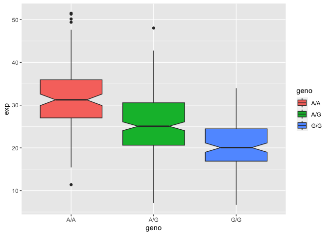

class11
================
Kyle Alvarez

## Section 4: Population Scale Analysis

One sample is obviously not enough to know what is happening in a
population. You are interested in assessing genetic differences on a
population scale. So, you processed about \~230 samples and did the
normalization on a genome level. Now, you want to find whether there is
any association of the 4 asthma-associated SNPs (rs8067378…) on ORMDL3
expression.

How many samples do we have?

> Q13: Read this file into R and determine the sample size for each
> genotype and their corresponding median expression levels for each of
> these genotypes.

``` r
expr <- read.table("rs8067378_ENSG00000172057.6.txt")
head(expr)
```

       sample geno      exp
    1 HG00367  A/G 28.96038
    2 NA20768  A/G 20.24449
    3 HG00361  A/A 31.32628
    4 HG00135  A/A 34.11169
    5 NA18870  G/G 18.25141
    6 NA11993  A/A 32.89721

``` r
nrow(expr)
```

    [1] 462

``` r
table(expr$geno)
```


    A/A A/G G/G 
    108 233 121 

``` r
library(ggplot2)
```

Let’s make a boxplot

> Q14: Generate a boxplot with a box per genotype, what could you infer
> from the relative expression value between A/A and G/G displayed in
> this plot? Does the SNP effect the expression of ORMDL3?

I can infer that the relative expression of A/A is higher than the
relative expression of G/G as displayed from this plot. The relative
expression of A/A cetners around the 32 mark in expression whilst G/G
centers around the 20 mark in expression. The SNP seems to effect the
expression of ORMDL3 as the different genotypes give off different
expression. If it were not to effect expression we should expect the
same relative amount of expression between the three genotypes. However
a t-test should be done in order to confirm if the results are
statistically signficant and not due to random causes.

``` r
ggplot(expr) + aes(x=geno, y=exp, fill=geno) +
  geom_boxplot(notch=TRUE)
```


