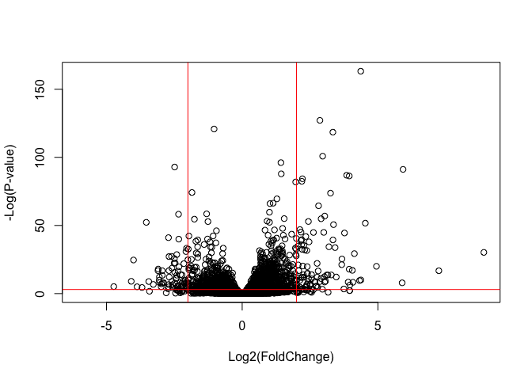

Class 12: RNASeq Analysis
================
Kyle Alvarez

In today’s class we will work with published RNA-seq experiment where
airway smooth muscle cells were treated with dexamethasone, a synthetic
glucocorticoid steroid with anti-inflammatory effects (Himes et
al. 2014).

## Data import

We will use good old `read.csv()` to read the two things we need for
this analysis:

- counta data
- col data (meta data

)

``` r
counts <- read.csv("airway_scaledcounts.csv", row.names=1)
metadata <-  read.csv("airway_metadata.csv")
```

> Q1. How many genes are in this dataset? There are 38694 genes in this
> dataset.

How many transcripts do I have?

``` r
nrow(counts)
```

    [1] 38694

Lets have a look at the metadata…

``` r
metadata
```

              id     dex celltype     geo_id
    1 SRR1039508 control   N61311 GSM1275862
    2 SRR1039509 treated   N61311 GSM1275863
    3 SRR1039512 control  N052611 GSM1275866
    4 SRR1039513 treated  N052611 GSM1275867
    5 SRR1039516 control  N080611 GSM1275870
    6 SRR1039517 treated  N080611 GSM1275871
    7 SRR1039520 control  N061011 GSM1275874
    8 SRR1039521 treated  N061011 GSM1275875

And the `counts` data

``` r
head(counts)
```

                    SRR1039508 SRR1039509 SRR1039512 SRR1039513 SRR1039516
    ENSG00000000003        723        486        904        445       1170
    ENSG00000000005          0          0          0          0          0
    ENSG00000000419        467        523        616        371        582
    ENSG00000000457        347        258        364        237        318
    ENSG00000000460         96         81         73         66        118
    ENSG00000000938          0          0          1          0          2
                    SRR1039517 SRR1039520 SRR1039521
    ENSG00000000003       1097        806        604
    ENSG00000000005          0          0          0
    ENSG00000000419        781        417        509
    ENSG00000000457        447        330        324
    ENSG00000000460         94        102         74
    ENSG00000000938          0          0          0

First we should check the correspondence of the metadata and count data

``` r
metadata$id
```

    [1] "SRR1039508" "SRR1039509" "SRR1039512" "SRR1039513" "SRR1039516"
    [6] "SRR1039517" "SRR1039520" "SRR1039521"

``` r
colnames(counts)
```

    [1] "SRR1039508" "SRR1039509" "SRR1039512" "SRR1039513" "SRR1039516"
    [6] "SRR1039517" "SRR1039520" "SRR1039521"

To check that these are all in the same order we can use `==` to test of
equality

``` r
all(metadata$id == colnames(counts))
```

    [1] TRUE

## Analysis via comparison of CONTROL vs TREATED

The “treated” have the dex drug and the “control” do not. First I need
to be able to extract just the “control columns in the `counts` data.

``` r
control.inds <- metadata$dex == "control"
control <-metadata[control.inds,]
control$id
```

    [1] "SRR1039508" "SRR1039512" "SRR1039516" "SRR1039520"

> Q2. How many ‘control’ cell lines do we have? We have 4 control cell
> lines.

> Q3. How would you make the above code in either approach more robust?
> In either to make the above code more robust, you can remove the
> intermediate step of saving things into variables and essentially call
> the necessary functions on top of eachother. for example you can do
> metadata\[metadata\$dex == “control”, id\] and save this into a
> variable and then call rowSums on the saved variable..

Now I can use this to access just the “control” columns of my `counts`
data…

``` r
control.counts <- counts[,control$id]
head(control.counts)
```

                    SRR1039508 SRR1039512 SRR1039516 SRR1039520
    ENSG00000000003        723        904       1170        806
    ENSG00000000005          0          0          0          0
    ENSG00000000419        467        616        582        417
    ENSG00000000457        347        364        318        330
    ENSG00000000460         96         73        118        102
    ENSG00000000938          0          1          2          0

Find the mean count value for each transcript/gene by binding the
`rowMeans()`.

``` r
control.mean <- rowMeans(control.counts)
head(control.mean)
```

    ENSG00000000003 ENSG00000000005 ENSG00000000419 ENSG00000000457 ENSG00000000460 
             900.75            0.00          520.50          339.75           97.25 
    ENSG00000000938 
               0.75 

> Q4. Follow the same procedure for the treated samples (i.e. calculate
> the mean per gene across drug treated samples and assign to a labeled
> vector called treated.mean).

And now find a mean value for all the “treated” columns in the same way

``` r
treated.id <- metadata[metadata$dex == "treated", "id"]
treated.mean <- rowMeans(counts[,treated.id])
```

Now I have `control.mean` and `treated.mean`. Lets put them together for
safe keeping and ease of use later.

``` r
meancounts <- data.frame(control.mean, treated.mean)
head(meancounts)
```

                    control.mean treated.mean
    ENSG00000000003       900.75       658.00
    ENSG00000000005         0.00         0.00
    ENSG00000000419       520.50       546.00
    ENSG00000000457       339.75       316.50
    ENSG00000000460        97.25        78.75
    ENSG00000000938         0.75         0.00

> Q5 (a). Create a scatter plot showing the mean of the treated samples
> against the mean of the control samples. Your plot should look
> something like the following. Q5 (b).You could also use the ggplot2
> package to make this figure producing the plot below. What geom\_?()
> function would you use for this plot? Use geom_point() to make the
> plot in ggplot. Let’s do a quick plot to see how our data looks

``` r
plot(meancounts)
```


> Q6. Try plotting both axes on a log scale. What is the argument to
> plot() that allows you to do this? Using the log argument in the plot
> function. This is a very heavily skewed and over a wide range -
> calling out for a log transform!

``` r
plot(meancounts, log="xy")
```

    Warning in xy.coords(x, y, xlabel, ylabel, log): 15032 x values <= 0 omitted
    from logarithmic plot

    Warning in xy.coords(x, y, xlabel, ylabel, log): 15281 y values <= 0 omitted
    from logarithmic plot


We like working with log transformed data as it can help make things
more straightforward to interpret.

If we have no change:

``` r
log2(20/20)
```

    [1] 0

What about if we had a doubling:

``` r
log2(40/20)
```

    [1] 1

Half as much

``` r
log2(10/20)
```

    [1] -1

``` r
log2(80/20)
```

    [1] 2

We like working with log2 fold-change values. Let’s calculate them for
our data.

``` r
meancounts$log2fc <- log2(meancounts$treated.mean/meancounts$control.mean)
head(meancounts)
```

                    control.mean treated.mean      log2fc
    ENSG00000000003       900.75       658.00 -0.45303916
    ENSG00000000005         0.00         0.00         NaN
    ENSG00000000419       520.50       546.00  0.06900279
    ENSG00000000457       339.75       316.50 -0.10226805
    ENSG00000000460        97.25        78.75 -0.30441833
    ENSG00000000938         0.75         0.00        -Inf

> Q7. What is the purpose of the arr.ind argument in the which()
> function call above? Why would we then take the first column of the
> output and need to call the unique() function? The purpose of the
> arr.ind argument in the which() function is to return ONLY TRUE
> values. We take out the first column of the output in order to remove
> any samples with 0 counts and the unique function to ensure that we
> don’t count any row twice.

We want to filter out any genes (that is the rows) where we have ZERO
count data.

``` r
to.keep.inds <- rowSums(meancounts[,1:2] == 0) == 0 
head(to.keep.inds)
```

    ENSG00000000003 ENSG00000000005 ENSG00000000419 ENSG00000000457 ENSG00000000460 
               TRUE           FALSE            TRUE            TRUE            TRUE 
    ENSG00000000938 
              FALSE 

``` r
mycounts <- meancounts[to.keep.inds,]
nrow(mycounts)
```

    [1] 21817

> Q8. Using the up.ind vector above can you determine how many up
> regulated genes we have at the greater than 2 fc level? There are 250
> upregulated genes.

> Q9. Using the down.ind vector above can you determine how many down
> regulated genes we have at the greater than 2 fc level? There are 367
> down regulated genes.

A common threshold for calling genes as differentially expressed is a
log2 fold-change of +2 or -2.

``` r
sum(mycounts$log2fc > 2)
```

    [1] 250

``` r
sum(mycounts$log2fc < -2)
```

    [1] 367

What percent is this?

``` r
round((sum(mycounts$log2fc >= +2) / nrow(mycounts)) * 100, 2)
```

    [1] 1.44

And down regulated:

``` r
round((sum(mycounts$log2fc <= -2) / nrow(mycounts)) * 100, 2)
```

    [1] 2.22

> Q10. Do you trust these results? Why or why not? I do no trust these
> results because the data is fold-changed, these values can be large
> without being statistically significant and we have done nothing to
> analyze whether these results are statistically significant.

We need some stats to check if the drug induced difference is
significant!

# Turn to DESeq2

Let’s turn to doing this the correct way with the DESeq2 package.

``` r
library(DESeq2)
```

The main function in the DESeq2 package is called `deseq()`. It wants
our count data and our colData (metadata) as input in a specific way.

``` r
dds <- DESeqDataSetFromMatrix(countData = counts, 
                       colData = metadata,
                       design = ~dex)
```

    converting counts to integer mode

    Warning in DESeqDataSet(se, design = design, ignoreRank): some variables in
    design formula are characters, converting to factors

Now I can run the DESeq analysis.

``` r
dds <- DESeq(dds)
```

    estimating size factors

    estimating dispersions

    gene-wise dispersion estimates

    mean-dispersion relationship

    final dispersion estimates

    fitting model and testing

``` r
results(dds)
```

    log2 fold change (MLE): dex treated vs control 
    Wald test p-value: dex treated vs control 
    DataFrame with 38694 rows and 6 columns
                     baseMean log2FoldChange     lfcSE      stat    pvalue
                    <numeric>      <numeric> <numeric> <numeric> <numeric>
    ENSG00000000003  747.1942     -0.3507030  0.168246 -2.084470 0.0371175
    ENSG00000000005    0.0000             NA        NA        NA        NA
    ENSG00000000419  520.1342      0.2061078  0.101059  2.039475 0.0414026
    ENSG00000000457  322.6648      0.0245269  0.145145  0.168982 0.8658106
    ENSG00000000460   87.6826     -0.1471420  0.257007 -0.572521 0.5669691
    ...                   ...            ...       ...       ...       ...
    ENSG00000283115  0.000000             NA        NA        NA        NA
    ENSG00000283116  0.000000             NA        NA        NA        NA
    ENSG00000283119  0.000000             NA        NA        NA        NA
    ENSG00000283120  0.974916      -0.668258   1.69456 -0.394354  0.693319
    ENSG00000283123  0.000000             NA        NA        NA        NA
                         padj
                    <numeric>
    ENSG00000000003  0.163035
    ENSG00000000005        NA
    ENSG00000000419  0.176032
    ENSG00000000457  0.961694
    ENSG00000000460  0.815849
    ...                   ...
    ENSG00000283115        NA
    ENSG00000283116        NA
    ENSG00000283119        NA
    ENSG00000283120        NA
    ENSG00000283123        NA

Now that we have got so far is the log2 fold-change and the adjusted
p-value for the significance.

``` r
res <- results(dds)

head(res)
```

    log2 fold change (MLE): dex treated vs control 
    Wald test p-value: dex treated vs control 
    DataFrame with 6 rows and 6 columns
                      baseMean log2FoldChange     lfcSE      stat    pvalue
                     <numeric>      <numeric> <numeric> <numeric> <numeric>
    ENSG00000000003 747.194195     -0.3507030  0.168246 -2.084470 0.0371175
    ENSG00000000005   0.000000             NA        NA        NA        NA
    ENSG00000000419 520.134160      0.2061078  0.101059  2.039475 0.0414026
    ENSG00000000457 322.664844      0.0245269  0.145145  0.168982 0.8658106
    ENSG00000000460  87.682625     -0.1471420  0.257007 -0.572521 0.5669691
    ENSG00000000938   0.319167     -1.7322890  3.493601 -0.495846 0.6200029
                         padj
                    <numeric>
    ENSG00000000003  0.163035
    ENSG00000000005        NA
    ENSG00000000419  0.176032
    ENSG00000000457  0.961694
    ENSG00000000460  0.815849
    ENSG00000000938        NA

A first plot

``` r
plot(res$log2FoldChange, res$padj)
```


Well that plot sucked all the interesting P-values are down below zero.
I am going to take the log of the p-value

``` r
plot(res$log2FoldChange, log(res$padj))
```


``` r
log(0.05)
```

    [1] -2.995732

WE can flip the y-axis so the plot does not look “upside down”.

``` r
plot(res$log2FoldChange, -log(res$padj),
  ylab="-Log(P-value)", xlab="Log2(FoldChange)")

abline(v=c(-2,+2), col="red")
abline(h=-log(0.05), col = "red")
```



Add some color to indicate transcripts with large fold change and
significant differences between conditions

``` r
#Setup our custom point color vector
mycols <- rep("gray", nrow(res))
mycols[ abs(res$log2FoldChange) > 2 ] <- "red"

inds <- (res$padj < 0.01) & (abs(res$log2FoldChange) > 2)
mycols[inds] <- "blue"

#Volcano plot with custom colors
plot( res$log2FoldChange, -log(res$padj),
  col=mycols, ylab="-Log(P-value)", xlab="Log2(FoldChange)" )

# Cut off lines
abline(v=c(-2,2), col="gray", lty = 2)
abline(h=-log(0.1), col="gray", lty=2)
```


I will start by loading two Annotation packages from bioconductor:

``` r
library("AnnotationDbi")
library("org.Hs.eg.db")
```

The `mapIDs()` function “maps” database identifiers between different
databases. In other words it translates the identifiers used by one
database to that used by another database.

Let’s see what databases are available for Human data

``` r
columns(org.Hs.eg.db)
```

     [1] "ACCNUM"       "ALIAS"        "ENSEMBL"      "ENSEMBLPROT"  "ENSEMBLTRANS"
     [6] "ENTREZID"     "ENZYME"       "EVIDENCE"     "EVIDENCEALL"  "GENENAME"    
    [11] "GENETYPE"     "GO"           "GOALL"        "IPI"          "MAP"         
    [16] "OMIM"         "ONTOLOGY"     "ONTOLOGYALL"  "PATH"         "PFAM"        
    [21] "PMID"         "PROSITE"      "REFSEQ"       "SYMBOL"       "UCSCKG"      
    [26] "UNIPROT"     

My results are in the object `res`.

``` r
head(res)
```

    log2 fold change (MLE): dex treated vs control 
    Wald test p-value: dex treated vs control 
    DataFrame with 6 rows and 6 columns
                      baseMean log2FoldChange     lfcSE      stat    pvalue
                     <numeric>      <numeric> <numeric> <numeric> <numeric>
    ENSG00000000003 747.194195     -0.3507030  0.168246 -2.084470 0.0371175
    ENSG00000000005   0.000000             NA        NA        NA        NA
    ENSG00000000419 520.134160      0.2061078  0.101059  2.039475 0.0414026
    ENSG00000000457 322.664844      0.0245269  0.145145  0.168982 0.8658106
    ENSG00000000460  87.682625     -0.1471420  0.257007 -0.572521 0.5669691
    ENSG00000000938   0.319167     -1.7322890  3.493601 -0.495846 0.6200029
                         padj
                    <numeric>
    ENSG00000000003  0.163035
    ENSG00000000005        NA
    ENSG00000000419  0.176032
    ENSG00000000457  0.961694
    ENSG00000000460  0.815849
    ENSG00000000938        NA

``` r
res$symbol <- mapIds(org.Hs.eg.db,
                     keys=row.names(res),      # Our genenames
                     keytype="ENSEMBL",        # The format of our genenames
                     column="SYMBOL",          # The new format we want to add
                     multiVals="first")
```

    'select()' returned 1:many mapping between keys and columns

``` r
head(res)
```

    log2 fold change (MLE): dex treated vs control 
    Wald test p-value: dex treated vs control 
    DataFrame with 6 rows and 7 columns
                      baseMean log2FoldChange     lfcSE      stat    pvalue
                     <numeric>      <numeric> <numeric> <numeric> <numeric>
    ENSG00000000003 747.194195     -0.3507030  0.168246 -2.084470 0.0371175
    ENSG00000000005   0.000000             NA        NA        NA        NA
    ENSG00000000419 520.134160      0.2061078  0.101059  2.039475 0.0414026
    ENSG00000000457 322.664844      0.0245269  0.145145  0.168982 0.8658106
    ENSG00000000460  87.682625     -0.1471420  0.257007 -0.572521 0.5669691
    ENSG00000000938   0.319167     -1.7322890  3.493601 -0.495846 0.6200029
                         padj      symbol
                    <numeric> <character>
    ENSG00000000003  0.163035      TSPAN6
    ENSG00000000005        NA        TNMD
    ENSG00000000419  0.176032        DPM1
    ENSG00000000457  0.961694       SCYL3
    ENSG00000000460  0.815849    C1orf112
    ENSG00000000938        NA         FGR

> Q11. Run the mapIds() function two more times to add the Entrez ID and
> UniProt accession and GENENAME as new columns called
> res$entrez, res$uniprot and res\$genename.

Create a new column called `res$entrez`, `res$uniprot`, and
`res$genename`

``` r
res$entrez <- mapIds(org.Hs.eg.db,
                     keys=row.names(res),      # Our genenames
                     keytype="ENSEMBL",        # The format of our genenames
                     column="ENTREZID",          # The new format we want to add
                     multiVals="first")
```

    'select()' returned 1:many mapping between keys and columns

``` r
res$uniprot<- mapIds(org.Hs.eg.db,
                     keys=row.names(res),      # Our genenames
                     keytype="ENSEMBL",        # The format of our genenames
                     column="UNIPROT",          # The new format we want to add
                     multiVals="first")
```

    'select()' returned 1:many mapping between keys and columns

``` r
res$genename <- mapIds(org.Hs.eg.db,
                     keys=row.names(res),      # Our genenames
                     keytype="ENSEMBL",        # The format of our genenames
                     column="GENENAME",          # The new format we want to add
                     multiVals="first")
```

    'select()' returned 1:many mapping between keys and columns

``` r
head(res)
```

    log2 fold change (MLE): dex treated vs control 
    Wald test p-value: dex treated vs control 
    DataFrame with 6 rows and 10 columns
                      baseMean log2FoldChange     lfcSE      stat    pvalue
                     <numeric>      <numeric> <numeric> <numeric> <numeric>
    ENSG00000000003 747.194195     -0.3507030  0.168246 -2.084470 0.0371175
    ENSG00000000005   0.000000             NA        NA        NA        NA
    ENSG00000000419 520.134160      0.2061078  0.101059  2.039475 0.0414026
    ENSG00000000457 322.664844      0.0245269  0.145145  0.168982 0.8658106
    ENSG00000000460  87.682625     -0.1471420  0.257007 -0.572521 0.5669691
    ENSG00000000938   0.319167     -1.7322890  3.493601 -0.495846 0.6200029
                         padj      symbol      entrez     uniprot
                    <numeric> <character> <character> <character>
    ENSG00000000003  0.163035      TSPAN6        7105  A0A024RCI0
    ENSG00000000005        NA        TNMD       64102      Q9H2S6
    ENSG00000000419  0.176032        DPM1        8813      O60762
    ENSG00000000457  0.961694       SCYL3       57147      Q8IZE3
    ENSG00000000460  0.815849    C1orf112       55732  A0A024R922
    ENSG00000000938        NA         FGR        2268      P09769
                                  genename
                               <character>
    ENSG00000000003          tetraspanin 6
    ENSG00000000005            tenomodulin
    ENSG00000000419 dolichyl-phosphate m..
    ENSG00000000457 SCY1 like pseudokina..
    ENSG00000000460 chromosome 1 open re..
    ENSG00000000938 FGR proto-oncogene, ..

# Pathway Analysis

Pathway analysis (also known as gene set analysis or over-representation
analysis), aims to reduce the complexity of interpreting gene lists via
mapping the listed genes to known (i.e. annotated) biological pathways,
processes and functions.

Some major genesets include KEGG, GO, etc. We will use the **gage**
package for our first pathway analysis

``` r
library(pathview)
```

    ##############################################################################
    Pathview is an open source software package distributed under GNU General
    Public License version 3 (GPLv3). Details of GPLv3 is available at
    http://www.gnu.org/licenses/gpl-3.0.html. Particullary, users are required to
    formally cite the original Pathview paper (not just mention it) in publications
    or products. For details, do citation("pathview") within R.

    The pathview downloads and uses KEGG data. Non-academic uses may require a KEGG
    license agreement (details at http://www.kegg.jp/kegg/legal.html).
    ##############################################################################

``` r
library(gage)
```

``` r
library(gageData)

data(kegg.sets.hs)
```

We can look at the first few pathways in the kegg human set.

``` r
head(kegg.sets.hs, 2)
```

    $`hsa00232 Caffeine metabolism`
    [1] "10"   "1544" "1548" "1549" "1553" "7498" "9"   

    $`hsa00983 Drug metabolism - other enzymes`
     [1] "10"     "1066"   "10720"  "10941"  "151531" "1548"   "1549"   "1551"  
     [9] "1553"   "1576"   "1577"   "1806"   "1807"   "1890"   "221223" "2990"  
    [17] "3251"   "3614"   "3615"   "3704"   "51733"  "54490"  "54575"  "54576" 
    [25] "54577"  "54578"  "54579"  "54600"  "54657"  "54658"  "54659"  "54963" 
    [33] "574537" "64816"  "7083"   "7084"   "7172"   "7363"   "7364"   "7365"  
    [41] "7366"   "7367"   "7371"   "7372"   "7378"   "7498"   "79799"  "83549" 
    [49] "8824"   "8833"   "9"      "978"   

The main `gage()` function wants a vector as input that contains our
measure of importance - in our case that is fold-change. The vector
needs to have ENTREZ ids as the names of the vector.

Recall that vectors can have names - this is useful for book-keeping so
I know what value corresponds to a certain gene for exmaple.

``` r
x <-  c(100, 80, 10)
x
```

    [1] 100  80  10

``` r
names(x) <- c("barry", "lisa", "sandra") 
x
```

     barry   lisa sandra 
       100     80     10 

``` r
foldchanges = res$log2FoldChange
names(foldchanges) = res$entrez
head(foldchanges)
```

           7105       64102        8813       57147       55732        2268 
    -0.35070302          NA  0.20610777  0.02452695 -0.14714205 -1.73228897 

Now we can run the analysis

``` r
# Get the results
keggres = gage(foldchanges, gsets=kegg.sets.hs)
```

What is in this results object

``` r
attributes(keggres)
```

    $names
    [1] "greater" "less"    "stats"  

By default gage splits it’s results into “greater” and “less” objects
that you can examine. First we will look at the “less” (i.e.) down
regulated pathway results

``` r
head(keggres$less, 3)
```

                                          p.geomean stat.mean        p.val
    hsa05332 Graft-versus-host disease 0.0004250461 -3.473346 0.0004250461
    hsa04940 Type I diabetes mellitus  0.0017820293 -3.002352 0.0017820293
    hsa05310 Asthma                    0.0020045888 -3.009050 0.0020045888
                                            q.val set.size         exp1
    hsa05332 Graft-versus-host disease 0.09053483       40 0.0004250461
    hsa04940 Type I diabetes mellitus  0.14232581       42 0.0017820293
    hsa05310 Asthma                    0.14232581       29 0.0020045888

We can now look in more detail at these pathways. The `pathview()`
function will take the KEGG pathway ID (printed first above) and our
vector of importance and annotate the pathway with our genes.

First I will look at hsa05310 Asthma.

``` r
pathview(gene.data=foldchanges, pathway.id = "hsa05310")
```

    'select()' returned 1:1 mapping between keys and columns

    Info: Working in directory /Users/kylealvarez/Desktop/BIMM143/Bioinformatics-Course-UCSD/week06/class12

    Info: Writing image file hsa05310.pathview.png


