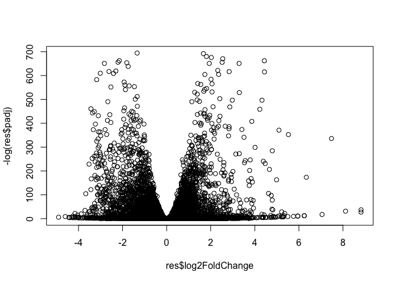
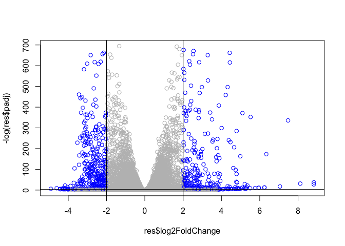
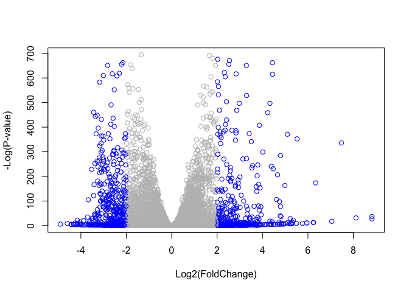

Class 13: RNASeq Mini Project
================
Kyle

> Trapnell C, Hendrickson DG, Sauvageau M, Goff L et al. “Differential
> analysis of gene regulation at transcript resolution with RNA-seq”.
> Nat Biotechnol 2013 Jan;31(1):46-53. PMID: 23222703

The authors report on differential analysis of lung fibroblasts in
response to loss of the developmental transcription factor HOXA1.

## RNASeq input data

Again I need to things

- countData
- colData

``` r
colData <- read.csv("GSE37704_metadata.csv", row.names = 1)
head(colData)
```

                  condition
    SRR493366 control_sirna
    SRR493367 control_sirna
    SRR493368 control_sirna
    SRR493369      hoxa1_kd
    SRR493370      hoxa1_kd
    SRR493371      hoxa1_kd

``` r
countData <- read.csv("GSE37704_featurecounts.csv", row.names = 1)
head(countData)
```

                    length SRR493366 SRR493367 SRR493368 SRR493369 SRR493370
    ENSG00000186092    918         0         0         0         0         0
    ENSG00000279928    718         0         0         0         0         0
    ENSG00000279457   1982        23        28        29        29        28
    ENSG00000278566    939         0         0         0         0         0
    ENSG00000273547    939         0         0         0         0         0
    ENSG00000187634   3214       124       123       205       207       212
                    SRR493371
    ENSG00000186092         0
    ENSG00000279928         0
    ENSG00000279457        46
    ENSG00000278566         0
    ENSG00000273547         0
    ENSG00000187634       258

> Q. Complete the code below to remove the troublesome first column from
> countData

There is an unwated first column “length” in the countData. I will need
to remove this first before going on to further analysis:

``` r
counts <- countData[, -1]
head(counts)
```

                    SRR493366 SRR493367 SRR493368 SRR493369 SRR493370 SRR493371
    ENSG00000186092         0         0         0         0         0         0
    ENSG00000279928         0         0         0         0         0         0
    ENSG00000279457        23        28        29        29        28        46
    ENSG00000278566         0         0         0         0         0         0
    ENSG00000273547         0         0         0         0         0         0
    ENSG00000187634       124       123       205       207       212       258

``` r
all(colnames(counts) == rownames(colData))
```

    [1] TRUE

## Filtering

There is a lot of data with 0 counts for read, so we want to filter them
out before using DeSeq. \> Q. Complete the code below to filter
countData to exclude genes (i.e. rows) where we have 0 read count across
all samples (i.e. columns).

``` r
# Filter count data where you have 0 read count across all samples.
to.keep = rowSums(counts) > 0
counts <-counts[to.keep,]
head(counts)
```

                    SRR493366 SRR493367 SRR493368 SRR493369 SRR493370 SRR493371
    ENSG00000279457        23        28        29        29        28        46
    ENSG00000187634       124       123       205       207       212       258
    ENSG00000188976      1637      1831      2383      1226      1326      1504
    ENSG00000187961       120       153       180       236       255       357
    ENSG00000187583        24        48        65        44        48        64
    ENSG00000187642         4         9        16        14        16        16

How many genes do we have left?

``` r
nrow(counts)
```

    [1] 15975

## Run DeSeq Analysis

Time to use DESeq

``` r
library(DESeq2)
```

1st step Setup the object required by DESeq

``` r
dds <- DESeqDataSetFromMatrix(countData = counts,
                       colData = colData,
                       design = ~condition)
```

    Warning in DESeqDataSet(se, design = design, ignoreRank): some variables in
    design formula are characters, converting to factors

Run the analysis

``` r
dds <- DESeq(dds)
```

    estimating size factors

    estimating dispersions

    gene-wise dispersion estimates

    mean-dispersion relationship

    final dispersion estimates

    fitting model and testing

``` r
res <- results(dds, contrast=c("condition", "hoxa1_kd", "control_sirna"))
```

> Q. Call the summary() function on your results to get a sense of how
> many genes are up or down-regulated at the default 0.1 p-value cutoff.

``` r
summary(res)
```


    out of 15975 with nonzero total read count
    adjusted p-value < 0.1
    LFC > 0 (up)       : 4349, 27%
    LFC < 0 (down)     : 4396, 28%
    outliers [1]       : 0, 0%
    low counts [2]     : 1237, 7.7%
    (mean count < 0)
    [1] see 'cooksCutoff' argument of ?results
    [2] see 'independentFiltering' argument of ?results

``` r
head(res)
```

    log2 fold change (MLE): condition hoxa1_kd vs control_sirna 
    Wald test p-value: condition hoxa1 kd vs control sirna 
    DataFrame with 6 rows and 6 columns
                     baseMean log2FoldChange     lfcSE       stat      pvalue
                    <numeric>      <numeric> <numeric>  <numeric>   <numeric>
    ENSG00000279457   29.9136      0.1792571 0.3248216   0.551863 5.81042e-01
    ENSG00000187634  183.2296      0.4264571 0.1402658   3.040350 2.36304e-03
    ENSG00000188976 1651.1881     -0.6927205 0.0548465 -12.630158 1.43990e-36
    ENSG00000187961  209.6379      0.7297556 0.1318599   5.534326 3.12428e-08
    ENSG00000187583   47.2551      0.0405765 0.2718928   0.149237 8.81366e-01
    ENSG00000187642   11.9798      0.5428105 0.5215598   1.040744 2.97994e-01
                           padj
                      <numeric>
    ENSG00000279457 6.86555e-01
    ENSG00000187634 5.15718e-03
    ENSG00000188976 1.76549e-35
    ENSG00000187961 1.13413e-07
    ENSG00000187583 9.19031e-01
    ENSG00000187642 4.03379e-01

## Volcano Plot

``` r
plot(res$log2FoldChange, -log(res$padj))
```



> Q. Improve this plot by completing the below code, which adds color
> and axis labels

I want to add some color. Take a fold-change threshold pf -2/+2 and an
alpha p-adh (P-value) threshold of 0.05.

``` r
mycols <- rep("gray", nrow(counts))
mycols [ abs(res$log2FoldChange ) > 2] = "blue"
mycols [ res$padj > 0.05 ] <- "gray"
plot(res$log2FoldChange, -log(res$padj), col = mycols)
abline(v=c(-2,+2))
abline(h = -log(0.05) )
```



``` r
# Make a color vector for all genes
mycols <- rep("gray", nrow(counts) )

# Color red the genes with absolute fold change above 2
mycols[ abs(res$log2FoldChange) > 2 ] = "red"

# Color blue those with adjusted p-value less than 0.01
#  and absolute fold change more than 2
inds <- (res$padj) & (abs(res$log2FoldChange) > 2 )
mycols[ inds ] = "blue"

plot( res$log2FoldChange, -log(res$padj), col=mycols, xlab="Log2(FoldChange)", ylab="-Log(P-value)" )
```



## Adding gene annotation

I am going to add the database identifiers I need for pathway analysis

``` r
library("AnnotationDbi")
library("org.Hs.eg.db")
```

``` r
columns(org.Hs.eg.db)
```

     [1] "ACCNUM"       "ALIAS"        "ENSEMBL"      "ENSEMBLPROT"  "ENSEMBLTRANS"
     [6] "ENTREZID"     "ENZYME"       "EVIDENCE"     "EVIDENCEALL"  "GENENAME"    
    [11] "GENETYPE"     "GO"           "GOALL"        "IPI"          "MAP"         
    [16] "OMIM"         "ONTOLOGY"     "ONTOLOGYALL"  "PATH"         "PFAM"        
    [21] "PMID"         "PROSITE"      "REFSEQ"       "SYMBOL"       "UCSCKG"      
    [26] "UNIPROT"     

``` r
res$symbol = mapIds(org.Hs.eg.db,
                    keys=rownames(res), 
                    keytype="ENSEMBL",
                    column="SYMBOL",
                    multiVals="first")
```

    'select()' returned 1:many mapping between keys and columns

``` r
res$entrez = mapIds(org.Hs.eg.db,
                    keys=rownames(res),
                    keytype="ENSEMBL",
                    column="ENTREZID",
                    multiVals="first")
```

    'select()' returned 1:many mapping between keys and columns

``` r
res$name =   mapIds(org.Hs.eg.db,
                    keys=row.names(res),
                    keytype="ENSEMBL",
                    column="GO",
                    multiVals="first")
```

    'select()' returned 1:many mapping between keys and columns

``` r
head(res)
```

    log2 fold change (MLE): condition hoxa1_kd vs control_sirna 
    Wald test p-value: condition hoxa1 kd vs control sirna 
    DataFrame with 6 rows and 9 columns
                     baseMean log2FoldChange     lfcSE       stat      pvalue
                    <numeric>      <numeric> <numeric>  <numeric>   <numeric>
    ENSG00000279457   29.9136      0.1792571 0.3248216   0.551863 5.81042e-01
    ENSG00000187634  183.2296      0.4264571 0.1402658   3.040350 2.36304e-03
    ENSG00000188976 1651.1881     -0.6927205 0.0548465 -12.630158 1.43990e-36
    ENSG00000187961  209.6379      0.7297556 0.1318599   5.534326 3.12428e-08
    ENSG00000187583   47.2551      0.0405765 0.2718928   0.149237 8.81366e-01
    ENSG00000187642   11.9798      0.5428105 0.5215598   1.040744 2.97994e-01
                           padj      symbol      entrez        name
                      <numeric> <character> <character> <character>
    ENSG00000279457 6.86555e-01          NA          NA          NA
    ENSG00000187634 5.15718e-03      SAMD11      148398  GO:0003682
    ENSG00000188976 1.76549e-35       NOC2L       26155  GO:0000122
    ENSG00000187961 1.13413e-07      KLHL17      339451  GO:0005515
    ENSG00000187583 9.19031e-01     PLEKHN1       84069  GO:0001666
    ENSG00000187642 4.03379e-01       PERM1       84808  GO:0005634

> Q. Finally for this section let’s reorder these results by adjusted
> p-value and save them to a CSV file in your current project directory.

``` r
res = res[order(res$pvalue),]
write.csv(res, file="deseq_results.csv")
```

## Pathway Analysis

Again we will use the `gage()` package and function with a focus first
on KEGG and go

``` r
library(gage)
```

``` r
library(gageData)

data(kegg.sets.hs)
data(sigmet.idx.hs)

# Focus on signaling and metabolic pathways only
kegg.sets.hs = kegg.sets.hs[sigmet.idx.hs]
```

Recall that `gage()` wants only a vector of improtance as input that has
names in ENTREZ ID format.

``` r
foldchanges = res$log2FoldChange
names(foldchanges) = res$entrez
head(foldchanges)
```

         1266     54855      1465     51232      2034      2317 
    -2.422719  3.201955 -2.313738 -2.059631 -1.888019 -1.649792 

``` r
keggres = gage(foldchanges, gsets=kegg.sets.hs)
```

``` r
head(keggres$less)
```

                                             p.geomean stat.mean        p.val
    hsa04110 Cell cycle                   8.995727e-06 -4.378644 8.995727e-06
    hsa03030 DNA replication              9.424076e-05 -3.951803 9.424076e-05
    hsa03013 RNA transport                1.375901e-03 -3.028500 1.375901e-03
    hsa03440 Homologous recombination     3.066756e-03 -2.852899 3.066756e-03
    hsa04114 Oocyte meiosis               3.784520e-03 -2.698128 3.784520e-03
    hsa00010 Glycolysis / Gluconeogenesis 8.961413e-03 -2.405398 8.961413e-03
                                                q.val set.size         exp1
    hsa04110 Cell cycle                   0.001448312      121 8.995727e-06
    hsa03030 DNA replication              0.007586381       36 9.424076e-05
    hsa03013 RNA transport                0.073840037      144 1.375901e-03
    hsa03440 Homologous recombination     0.121861535       28 3.066756e-03
    hsa04114 Oocyte meiosis               0.121861535      102 3.784520e-03
    hsa00010 Glycolysis / Gluconeogenesis 0.212222694       53 8.961413e-03

Generate a colored pathway figure for

``` r
library(pathview)
```

    ##############################################################################
    Pathview is an open source software package distributed under GNU General
    Public License version 3 (GPLv3). Details of GPLv3 is available at
    http://www.gnu.org/licenses/gpl-3.0.html. Particullary, users are required to
    formally cite the original Pathview paper (not just mention it) in publications
    or products. For details, do citation("pathview") within R.

    The pathview downloads and uses KEGG data. Non-academic uses may require a KEGG
    license agreement (details at http://www.kegg.jp/kegg/legal.html).
    ##############################################################################

``` r
pathview(gene.data=foldchanges, pathway.id="hsa04110")
```

    'select()' returned 1:1 mapping between keys and columns

    Info: Working in directory /Users/kylealvarez/Desktop/BIMM143/Bioinformatics-Course-UCSD/week07/class13

    Info: Writing image file hsa04110.pathview.png


We can look at the top5 upregulated pathways

``` r
## Focus on top 5 upregulated pathways here for demo purposes only
keggrespathways <- rownames(keggres$greater)[1:5]

# Extract the 8 character long IDs part of each string
keggresids = substr(keggrespathways, start=1, stop=8)
keggresids
```

    [1] "hsa04640" "hsa04630" "hsa00140" "hsa04142" "hsa04330"

We can then generate the `pathview()` functions to plot the top 5
up-regulated pathways.

``` r
pathview(gene.data=foldchanges, pathway.id=keggresids, species="hsa")
```

    'select()' returned 1:1 mapping between keys and columns

    Info: Working in directory /Users/kylealvarez/Desktop/BIMM143/Bioinformatics-Course-UCSD/week07/class13

    Info: Writing image file hsa04640.pathview.png

    'select()' returned 1:1 mapping between keys and columns

    Info: Working in directory /Users/kylealvarez/Desktop/BIMM143/Bioinformatics-Course-UCSD/week07/class13

    Info: Writing image file hsa04630.pathview.png

    'select()' returned 1:1 mapping between keys and columns

    Info: Working in directory /Users/kylealvarez/Desktop/BIMM143/Bioinformatics-Course-UCSD/week07/class13

    Info: Writing image file hsa00140.pathview.png

    'select()' returned 1:1 mapping between keys and columns

    Info: Working in directory /Users/kylealvarez/Desktop/BIMM143/Bioinformatics-Course-UCSD/week07/class13

    Info: Writing image file hsa04142.pathview.png

    Info: some node width is different from others, and hence adjusted!

    'select()' returned 1:1 mapping between keys and columns

    Info: Working in directory /Users/kylealvarez/Desktop/BIMM143/Bioinformatics-Course-UCSD/week07/class13

    Info: Writing image file hsa04330.pathview.png

> Q. Can you do the same procedure as above to plot the pathview figures
> for the top 5 down-reguled pathways?

``` r
## Focus on top 5 downpregulated pathways here for demo purposes only
keggrespathways <- rownames(keggres$less)[1:5]

# Extract the 8 character long IDs part of each string
keggresidsdown = substr(keggrespathways, start=1, stop=8)
keggresidsdown
```

    [1] "hsa04110" "hsa03030" "hsa03013" "hsa03440" "hsa04114"

``` r
pathview(gene.data=foldchanges, pathway.id=keggresidsdown, species="hsa")
```

    'select()' returned 1:1 mapping between keys and columns

    Info: Working in directory /Users/kylealvarez/Desktop/BIMM143/Bioinformatics-Course-UCSD/week07/class13

    Info: Writing image file hsa04110.pathview.png

    'select()' returned 1:1 mapping between keys and columns

    Info: Working in directory /Users/kylealvarez/Desktop/BIMM143/Bioinformatics-Course-UCSD/week07/class13

    Info: Writing image file hsa03030.pathview.png

    'select()' returned 1:1 mapping between keys and columns

    Info: Working in directory /Users/kylealvarez/Desktop/BIMM143/Bioinformatics-Course-UCSD/week07/class13

    Info: Writing image file hsa03013.pathview.png

    'select()' returned 1:1 mapping between keys and columns

    Info: Working in directory /Users/kylealvarez/Desktop/BIMM143/Bioinformatics-Course-UCSD/week07/class13

    Info: Writing image file hsa03440.pathview.png

    'select()' returned 1:1 mapping between keys and columns

    Info: Working in directory /Users/kylealvarez/Desktop/BIMM143/Bioinformatics-Course-UCSD/week07/class13

    Info: Writing image file hsa04114.pathview.png

## Gene Ontology

We can do a similar procedure with gene ontology. **go.sets.hs** has all
GO terms. **go.subs.hs** is a named list containing indexes for the BP,
CC, and MF ontologies.

Let’s focus on Biological Processes (i.e BP)

``` r
data(go.sets.hs)
data(go.subs.hs)

# Focus on Biological Process subset of GO
gobpsets = go.sets.hs[go.subs.hs$BP]

gobpres = gage(foldchanges, gsets=gobpsets, same.dir=TRUE)

lapply(gobpres, head)
```

    $greater
                                                 p.geomean stat.mean        p.val
    GO:0007156 homophilic cell adhesion       8.519724e-05  3.824205 8.519724e-05
    GO:0002009 morphogenesis of an epithelium 1.396681e-04  3.653886 1.396681e-04
    GO:0048729 tissue morphogenesis           1.432451e-04  3.643242 1.432451e-04
    GO:0007610 behavior                       2.195494e-04  3.530241 2.195494e-04
    GO:0060562 epithelial tube morphogenesis  5.932837e-04  3.261376 5.932837e-04
    GO:0035295 tube development               5.953254e-04  3.253665 5.953254e-04
                                                  q.val set.size         exp1
    GO:0007156 homophilic cell adhesion       0.1951953      113 8.519724e-05
    GO:0002009 morphogenesis of an epithelium 0.1951953      339 1.396681e-04
    GO:0048729 tissue morphogenesis           0.1951953      424 1.432451e-04
    GO:0007610 behavior                       0.2243795      427 2.195494e-04
    GO:0060562 epithelial tube morphogenesis  0.3711390      257 5.932837e-04
    GO:0035295 tube development               0.3711390      391 5.953254e-04

    $less
                                                p.geomean stat.mean        p.val
    GO:0048285 organelle fission             1.536227e-15 -8.063910 1.536227e-15
    GO:0000280 nuclear division              4.286961e-15 -7.939217 4.286961e-15
    GO:0007067 mitosis                       4.286961e-15 -7.939217 4.286961e-15
    GO:0000087 M phase of mitotic cell cycle 1.169934e-14 -7.797496 1.169934e-14
    GO:0007059 chromosome segregation        2.028624e-11 -6.878340 2.028624e-11
    GO:0000236 mitotic prometaphase          1.729553e-10 -6.695966 1.729553e-10
                                                    q.val set.size         exp1
    GO:0048285 organelle fission             5.841698e-12      376 1.536227e-15
    GO:0000280 nuclear division              5.841698e-12      352 4.286961e-15
    GO:0007067 mitosis                       5.841698e-12      352 4.286961e-15
    GO:0000087 M phase of mitotic cell cycle 1.195672e-11      362 1.169934e-14
    GO:0007059 chromosome segregation        1.658603e-08      142 2.028624e-11
    GO:0000236 mitotic prometaphase          1.178402e-07       84 1.729553e-10

    $stats
                                              stat.mean     exp1
    GO:0007156 homophilic cell adhesion        3.824205 3.824205
    GO:0002009 morphogenesis of an epithelium  3.653886 3.653886
    GO:0048729 tissue morphogenesis            3.643242 3.643242
    GO:0007610 behavior                        3.530241 3.530241
    GO:0060562 epithelial tube morphogenesis   3.261376 3.261376
    GO:0035295 tube development                3.253665 3.253665

## Reactome Analysis

Reactome is database consisting of biological molecules and their
relation to pathways and processes.

Let’s now conduct over-representation enrichment analysis and
pathway-topology analysis with Reactome using the previous list of
significant genes generated from our differential expression results
above.

First, Using R, output the list of significant genes at the 0.05 level
as a plain text file:

``` r
sig_genes <- res[res$padj <= 0.05 & !is.na(res$padj), "symbol"]
print(paste("Total number of significant genes:", length(sig_genes)))
```

    [1] "Total number of significant genes: 8147"

``` r
write.table(sig_genes, file="significant_genes.txt", row.names=FALSE, col.names=FALSE, quote=FALSE)
```

> Q: What pathway has the most significant “Entities p-value”? Do the
> most significant pathways listed match your previous KEGG results?
> What factors could cause differences between the two methods?

The pathway that has the most significant “Entities p-value” is the
Endosomal/Vacuolar Pathway. And the most significant pathways listed
does not match my previous KEGG results (. the factors that could be
causing the different is because the reactome is using an over
representation which might be causing certain pathways to show more
significantly compared to ours.

## GO Online

Gene Set Gene Ontology (GO) Enrichment is a method to determine
over-represented or under-represented GO terms for a given set of genes.
GO terms are formal structured controlled vocabularies (ontologies) for
gene products in terms of their biological function. The goal of this
analysis is to determine the biological process the given set of genes
are associated with.

> Q: What pathway has the most significant “Entities p-value”? Do the
> most significant pathways listed match your previous KEGG results?
> What factors could cause differences between the two methods?

The pathway that had the most signficant “Entites p-value” was the
regulation of cell migration involving angiogenesis. There are some
signicant pathways that overlap and match my previous KEGG results such
as the M phase of the cell cycle. One factor that could be causing
differences between the two methods is the data from which they are
pulling from, since databases might not match perfectly with others.
