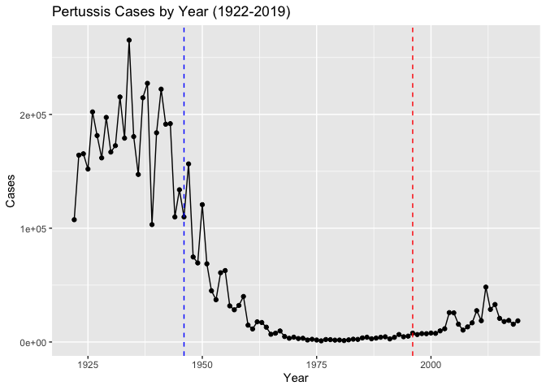
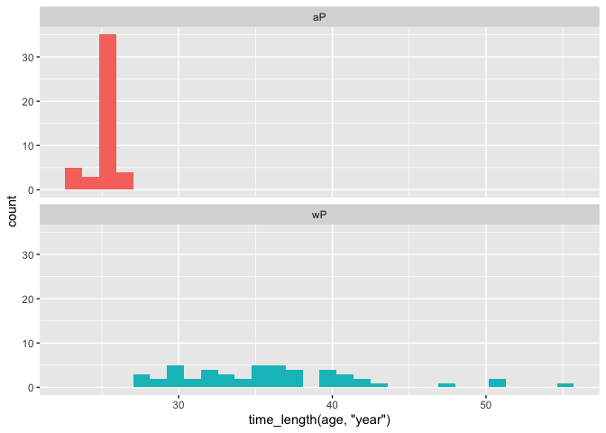
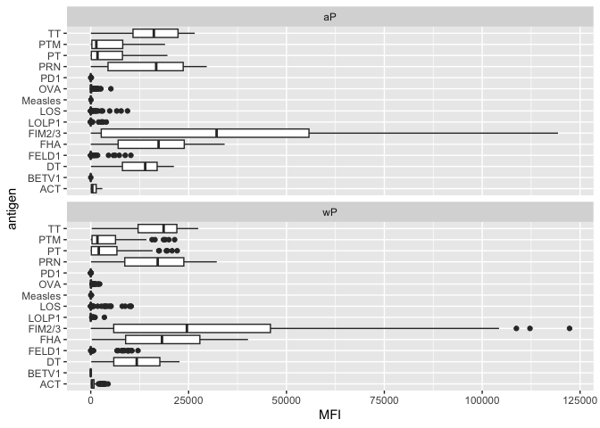

Class 18: Pertussis Mini-Proj
================
Kyle

Pertussis (more commonly known as whooping cough) is a highly contagious
respiratory disease caused by the bacterium Bordetella pertussis.
Bordetella pertussis attacks cells lining the airways. Recent estimates
from the WHO suggest that \~16 million cases and 200,000 infant deaths
are due to pertussis annually.

## Is Pertussis on the rise?

The CDC track reported Pertussis cases in US and make their data
available here:

https://www.cdc.gov/pertussis/surv-reporting/cases-by-year.html

``` r
cdc <- data.frame(
                          Year = c(1922L,
                                   1923L,1924L,1925L,1926L,1927L,1928L,
                                   1929L,1930L,1931L,1932L,1933L,1934L,1935L,
                                   1936L,1937L,1938L,1939L,1940L,1941L,
                                   1942L,1943L,1944L,1945L,1946L,1947L,1948L,
                                   1949L,1950L,1951L,1952L,1953L,1954L,
                                   1955L,1956L,1957L,1958L,1959L,1960L,
                                   1961L,1962L,1963L,1964L,1965L,1966L,1967L,
                                   1968L,1969L,1970L,1971L,1972L,1973L,
                                   1974L,1975L,1976L,1977L,1978L,1979L,1980L,
                                   1981L,1982L,1983L,1984L,1985L,1986L,
                                   1987L,1988L,1989L,1990L,1991L,1992L,1993L,
                                   1994L,1995L,1996L,1997L,1998L,1999L,
                                   2000L,2001L,2002L,2003L,2004L,2005L,
                                   2006L,2007L,2008L,2009L,2010L,2011L,2012L,
                                   2013L,2014L,2015L,2016L,2017L,2018L,
                                   2019L),
 Cases = c(107473,
                                   164191,165418,152003,202210,181411,
                                   161799,197371,166914,172559,215343,179135,
                                   265269,180518,147237,214652,227319,103188,
                                   183866,222202,191383,191890,109873,
                                   133792,109860,156517,74715,69479,120718,
                                   68687,45030,37129,60886,62786,31732,28295,
                                   32148,40005,14809,11468,17749,17135,
                                   13005,6799,7717,9718,4810,3285,4249,
                                   3036,3287,1759,2402,1738,1010,2177,2063,
                                   1623,1730,1248,1895,2463,2276,3589,
                                   4195,2823,3450,4157,4570,2719,4083,6586,
                                   4617,5137,7796,6564,7405,7298,7867,
                                   7580,9771,11647,25827,25616,15632,10454,
                                   13278,16858,27550,18719,48277,28639,
                                   32971,20762,17972,18975,15609,18617)
)
```

Make a plot of the year and the number of cases in ggplot2 to visualize
the trends of the pertussis virus.

``` r
library(ggplot2)

baseplot <- ggplot(cdc) +
  aes(x=Year, y=Cases) +
  geom_point() +
  geom_line() +
  labs(title = "Pertussis Cases by Year (1922-2019)")
```

> Q2. Using the ggplot geom_vline() function add lines to your previous
> plot for the 1946 introduction of the wP vaccine and the 1996 switch
> to aP vaccine (see example in the hint below). What do you notice?
> Pertussis cases started trending downwards after 1946.

> Q3. Describe what happened after the introduction of the aP vaccine?
> Do you have a possible explanation for the observed trend? After the
> introduction of the aP vaccine, pertussis cases started to trend a
> little upwards. Maybe because this vaccine only contains the most
> “important” parts, and not all the parts of the pertussis virus that
> is needed to make it the most effective. The virus could also be
> changing and have a variance now.

``` r
baseplot + geom_vline(xintercept = 1946, colour = "blue", linetype=2) +
  geom_vline(xintercept = 1996, colour = "red", linetype=2)
```



# Getting Data from CMI-PB

The CMI-PB resource is studying and making available data on the immune
response to Pertussis vaccination.

It mostly returns JSON formatted data that we need to process and
convert into something usable in R.

We will use the jsonlite package

``` r
library(jsonlite)
```

``` r
subject <- read_json("https://www.cmi-pb.org/api/subject", simplifyVector = TRUE) 
```

> Q4. How may aP and wP infancy vaccinated subjects are in the dataset?
> There are 47 aP infancy vaccinated subjects and 49 wP infancy
> vaccinated subjects.

``` r
table(subject$infancy_vac)
```


    aP wP 
    47 49 

> Q5. How many Male and Female subjects/patients are in the dataset?
> There are 30 Male and 66 Female subjects in the dataset.

``` r
table(subject$biological_sex)
```


    Female   Male 
        66     30 

> Q6. What is the breakdown of race and biological sex (e.g. number of
> Asian females, White males etc…)? The breakdown is in the table below,
> 18 Asian females, and 13 White males, etc.

``` r
table(subject$race, subject$biological_sex)
```

                                               
                                                Female Male
      American Indian/Alaska Native                  0    1
      Asian                                         18    9
      Black or African American                      2    0
      More Than One Race                             8    2
      Native Hawaiian or Other Pacific Islander      1    1
      Unknown or Not Reported                       10    4
      White                                         27   13

## Side-Note: Working with dates

To help ease the pain of working with dates we can use the
`library(lubridate)`

``` r
library(lubridate)
```

    Loading required package: timechange


    Attaching package: 'lubridate'

    The following objects are masked from 'package:base':

        date, intersect, setdiff, union

``` r
today()
```

    [1] "2022-12-01"

How many days have passed since new year 2000

``` r
today() - ymd("2000-01-01")
```

    Time difference of 8370 days

> Q7. Using this approach determine (i) the average age of wP
> individuals, (ii) the average age of aP individuals; and (iii) are
> they significantly different? i) The average age of wP individiuals is
> 36, the average age of aP individuals are 25. They are significantly
> different by about 11 years.

``` r
subject$age <- today() - ymd(subject$year_of_birth)
library(dplyr)
```


    Attaching package: 'dplyr'

    The following objects are masked from 'package:stats':

        filter, lag

    The following objects are masked from 'package:base':

        intersect, setdiff, setequal, union

``` r
# aP
ap <- subject %>% filter(infancy_vac == "aP")
round( summary( time_length( ap$age, "years" ) ) )
```

       Min. 1st Qu.  Median    Mean 3rd Qu.    Max. 
         23      25      26      25      26      27 

``` r
# wP
wp <- subject %>% filter(infancy_vac == "wP")
round( summary( time_length( wp$age, "years" ) ) )
```

       Min. 1st Qu.  Median    Mean 3rd Qu.    Max. 
         28      32      35      36      40      55 

> Q8. Determine the age of all individuals at time of boost Calculated
> right below here.

``` r
int <- ymd(subject$date_of_boost) - ymd(subject$year_of_birth)
age_at_boost <- time_length(int, "year")
head(age_at_boost)
```

    [1] 30.69678 51.07461 33.77413 28.65982 25.65914 28.77481

> Q9. With the help of a faceted boxplot (see below), do you think these
> two groups are significantly different? Yes these two groups are
> significantly different, since calculating the p-value yielded a value
> of 1.316045e-16.

``` r
ggplot(subject) +
  aes(time_length(age, "year"),
      fill=as.factor(infancy_vac)) +
  geom_histogram(show.legend=FALSE) +
  facet_wrap(vars(infancy_vac), nrow=2) 
```

    `stat_bin()` using `bins = 30`. Pick better value with `binwidth`.



``` r
# Or use wilcox.test() 
x <- t.test(time_length( wp$age, "years" ),
       time_length( ap$age, "years" ))

x$p.value
```

    [1] 1.316045e-16

# Ab titer data

``` r
# Complete the API URLs...
specimen <- read_json("https://www.cmi-pb.org/api/specimen", simplifyVector = TRUE) 
titer <- read_json("https://www.cmi-pb.org/api/ab_titer", simplifyVector = TRUE) 
```

Quick peak at the start of this speciman data

``` r
head(specimen)
```

      specimen_id subject_id actual_day_relative_to_boost
    1           1          1                           -3
    2           2          1                          736
    3           3          1                            1
    4           4          1                            3
    5           5          1                            7
    6           6          1                           11
      planned_day_relative_to_boost specimen_type visit
    1                             0         Blood     1
    2                           736         Blood    10
    3                             1         Blood     2
    4                             3         Blood     3
    5                             7         Blood     4
    6                            14         Blood     5

> Q9. Complete the code to join specimen and subject tables to make a
> new merged data frame containing all specimen records along with their
> associated subject details:

``` r
meta <- inner_join(specimen, subject)
```

    Joining, by = "subject_id"

``` r
dim(meta)
```

    [1] 729  14

``` r
head(meta)
```

      specimen_id subject_id actual_day_relative_to_boost
    1           1          1                           -3
    2           2          1                          736
    3           3          1                            1
    4           4          1                            3
    5           5          1                            7
    6           6          1                           11
      planned_day_relative_to_boost specimen_type visit infancy_vac biological_sex
    1                             0         Blood     1          wP         Female
    2                           736         Blood    10          wP         Female
    3                             1         Blood     2          wP         Female
    4                             3         Blood     3          wP         Female
    5                             7         Blood     4          wP         Female
    6                            14         Blood     5          wP         Female
                   ethnicity  race year_of_birth date_of_boost      dataset
    1 Not Hispanic or Latino White    1986-01-01    2016-09-12 2020_dataset
    2 Not Hispanic or Latino White    1986-01-01    2016-09-12 2020_dataset
    3 Not Hispanic or Latino White    1986-01-01    2016-09-12 2020_dataset
    4 Not Hispanic or Latino White    1986-01-01    2016-09-12 2020_dataset
    5 Not Hispanic or Latino White    1986-01-01    2016-09-12 2020_dataset
    6 Not Hispanic or Latino White    1986-01-01    2016-09-12 2020_dataset
             age
    1 13483 days
    2 13483 days
    3 13483 days
    4 13483 days
    5 13483 days
    6 13483 days

``` r
dim(specimen)
```

    [1] 729   6

``` r
dim(subject)
```

    [1] 96  9

> Q10. Now using the same procedure join meta with titer data so we can
> further analyze this data in terms of time of visit aP/wP, male/female
> etc.

``` r
abdata <- inner_join(titer, meta)
```

    Joining, by = "specimen_id"

``` r
dim(abdata)
```

    [1] 32675    21

> Q11. How many specimens (i.e. entries in abdata) do we have for each
> isotype?

``` r
table(abdata$isotype)
```


     IgE  IgG IgG1 IgG2 IgG3 IgG4 
    6698 1413 6141 6141 6141 6141 

> Q12. What do you notice about the number of visit 8 specimens compared
> to other visits? The number of visit 8 speciments has significantly
> lower than the other visits by a couple thousand.

``` r
table(abdata$visit)
```


       1    2    3    4    5    6    7    8 
    5795 4640 4640 4640 4640 4320 3920   80 

## Examine IgG1 Ab titer levels

Now using our joined/merged/linked abdata dataset filter() for IgG1
isotype and exclude the small number of visit 8 entries.

``` r
ig1 <- abdata %>% filter(isotype == "IgG1", visit!=8)
head(ig1)
```

      specimen_id isotype is_antigen_specific antigen        MFI MFI_normalised
    1           1    IgG1                TRUE     ACT 274.355068      0.6928058
    2           1    IgG1                TRUE     LOS  10.974026      2.1645083
    3           1    IgG1                TRUE   FELD1   1.448796      0.8080941
    4           1    IgG1                TRUE   BETV1   0.100000      1.0000000
    5           1    IgG1                TRUE   LOLP1   0.100000      1.0000000
    6           1    IgG1                TRUE Measles  36.277417      1.6638332
       unit lower_limit_of_detection subject_id actual_day_relative_to_boost
    1 IU/ML                 3.848750          1                           -3
    2 IU/ML                 4.357917          1                           -3
    3 IU/ML                 2.699944          1                           -3
    4 IU/ML                 1.734784          1                           -3
    5 IU/ML                 2.550606          1                           -3
    6 IU/ML                 4.438966          1                           -3
      planned_day_relative_to_boost specimen_type visit infancy_vac biological_sex
    1                             0         Blood     1          wP         Female
    2                             0         Blood     1          wP         Female
    3                             0         Blood     1          wP         Female
    4                             0         Blood     1          wP         Female
    5                             0         Blood     1          wP         Female
    6                             0         Blood     1          wP         Female
                   ethnicity  race year_of_birth date_of_boost      dataset
    1 Not Hispanic or Latino White    1986-01-01    2016-09-12 2020_dataset
    2 Not Hispanic or Latino White    1986-01-01    2016-09-12 2020_dataset
    3 Not Hispanic or Latino White    1986-01-01    2016-09-12 2020_dataset
    4 Not Hispanic or Latino White    1986-01-01    2016-09-12 2020_dataset
    5 Not Hispanic or Latino White    1986-01-01    2016-09-12 2020_dataset
    6 Not Hispanic or Latino White    1986-01-01    2016-09-12 2020_dataset
             age
    1 13483 days
    2 13483 days
    3 13483 days
    4 13483 days
    5 13483 days
    6 13483 days

Make a summary plot of antigen levels.

> Q13. Complete the following code to make a summary boxplot of Ab titer
> levels for all antigens:

``` r
ggplot(ig1) +
  aes(MFI, antigen) +
  geom_boxplot() + 
  facet_wrap(vars(visit), nrow=2)
```


``` r
ggplot(ig1) +
  aes(MFI, antigen) +
  geom_boxplot() + 
  facet_wrap(vars(infancy_vac), nrow=2)
```


